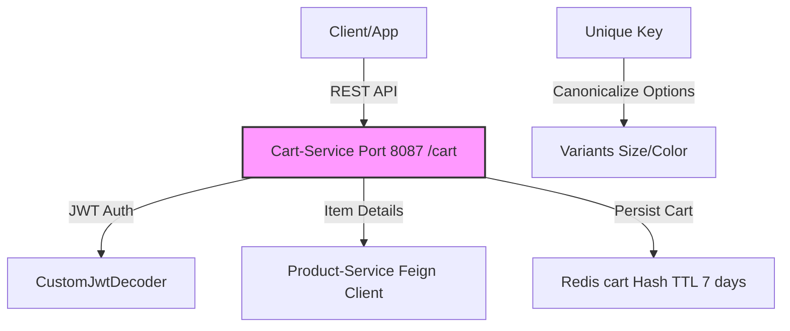

# Cart-Service - Quản Lý Giỏ Hàng

[](https://github.com/shopping-ecommerce/cart-service/actions) [](https://codecov.io/gh/shopping-ecommerce/cart-service) [](LICENSE) [](https://spring.io/projects/spring-boot) [](https://openjdk.org/) [](https://redis.io/)

## 📋 Mô Tả
Cart-Service là một microservice backend quản lý giỏ hàng cho ứng dụng e-commerce, sử dụng **Redis** làm storage chính (với TTL 7 ngày cho inactive carts). Xây dựng bằng **Spring Boot 3.x**, hỗ trợ add/update/remove/clear items (với variants qua options map như size/color), tính toán totals (subtotal, discount, estimated shipping >500k VND free, total), và summary/count. Tích hợp **Feign** để gọi Product-Service (search by ID/size/options cho real-time price/image/name).

Dự án tập trung vào performance (RedisHash indexed, unique keys cho variants), bảo mật (JWT cho tất cả endpoints), và usability (canonicalize options cho stability).

### 🏗️ Architecture
Kiến trúc microservices với Cart-Service làm core cho shopping session. Các thành phần chính:
- **Communication**: REST API, Feign client (Product cho item details).
- **Database**: Redis (Hash: cart, indexed userId; TTL 7 days).
- **Security**: JWT (OAuth2 Resource Server), all endpoints authenticated.
- **Deployment**: Docker + Kubernetes (giả định), port 8087 (context-path: /cart).


## ✨ Tính Năng Chính
- **Cart Operations**: Add to cart (with options), update quantity, remove single/batch items (by product/seller/options), clear entire cart.
- **Retrieval**: Get full cart by userId, summary (totals/items count), item count.
- **Calculations**: Auto-calculate subtotal/totalPrice per item, cart totals (subtotal + shipping 30k if <500k, discount=0 placeholder).
- **Variants Handling**: Options map (e.g., {"Size":"41","Color":"Black"}), unique key = sellerId-productId-canonicalized options.
- **Integration**: Feign ProductClient (searchBySizeAndID cho real-time product info).
- **Expiration**: TTL 7 days (configurable 30 days via cart.ttl-seconds), indexed userId cho fast lookup.
- **Error Handling**: Standardized ApiResponse, JWT entry point.

## 🛠️ Tech Stack
| Component          | Technology                  | Details                                      |
|--------------------|-----------------------------|----------------------------------------------|
| **Language/Framework** | Java 17+ / Spring Boot 3.x | REST Controllers, Security, Validation (@Valid) |
| **Database**       | Redis                       | @RedisHash("cart"), @Indexed userId, TTL 7 days |
| **Security**       | Spring Security (OAuth2)    | JWT converter (roles/scopes), all endpoints auth |
| **Client**         | OpenFeign                   | ProductClient (searchBySizeAndID, timeout 30s) |
| **Utils**          | Lombok, Jackson             | DTOs (AddToCartRequest etc.), TreeMap for canonicalize options |
| **Logging**        | SLF4J                       | Info cho operations, Jackson write-dates-as-timestamps=false |

## 🚀 Cài Đặt & Chạy
### Yêu Cầu
- Java 17+ / Maven 3.6+.
- Docker (cho Redis).
- Environment vars: `REDIS_HOST` (redis:6379), `FEIGN_PRODUCT` (http://product-service:8083/product) (xem application.yml).

### Bước 1: Clone Repo
```bash
git clone https://github.com/shopping-ecommerce/cart-service.git
cd cart-service
```

### Bước 2: Setup Môi Trường
```bash
# Copy env files (nếu có example)
cp src/main/resources/application.yml.example application.yml

# Build project
mvn clean install

# Setup Docker services (Redis)
docker-compose up -d  # Sử dụng docker-compose.yml nếu có
```

### Bước 3: Chạy Service
```bash
# Run với Maven
mvn spring-boot:run

# Hoặc JAR
java -jar target/cart-service-*.jar
```

- Port mặc định: **8087** (context: /cart, e.g., http://localhost:8087/cart/add).
- Test endpoints: Sử dụng Postman/Swagger (http://localhost:8087/cart/swagger-ui.html nếu enable). Tất cả cần JWT Bearer token.

Ví dụ test add to cart:
```bash
curl -X POST http://localhost:8087/cart/add \
  -H "Authorization: Bearer <jwt-token>" \
  -H "Content-Type: application/json" \
  -d '{"userId":"user123","productId":"prod456","quantity":2,"options":{"Size":"41"}}'
```

### Bước 4: Test & Debug
```bash
# Run tests
mvn test

# Check logs
tail -f logs/application.log  # Hoặc console
```

- Cart expires sau 7 ngày không hoạt động (TTL).
- Unique items: Different options = separate items.

## 📚 Tài Liệu
- **API Docs**: Sử dụng SpringDoc OpenAPI (Swagger UI tại `/swagger-ui.html`).
- **Endpoints** (base: /cart):
  | Method | Endpoint                          | Description                  | Auth Required    |
  |--------|-----------------------------------|------------------------------|------------------|
  | POST   | `/add`                            | Add to cart (with options)   | Yes              |
  | GET    | `/{userId}`                       | Get full cart                | Yes              |
  | GET    | `/{userId}/summary`               | Get cart summary (totals)    | Yes              |
  | GET    | `/{userId}/count`                 | Get item count               | Yes              |
  | PUT    | `/{userId}/update`                | Update item quantity         | Yes              |
  | DELETE | `/{userId}/items/{productId}`     | Remove single item (options?)| Yes             |
  | DELETE | `/{userId}`                       | Clear entire cart            | Yes              |
  | DELETE | `/{userId}/items/batch`           | Remove batch items           | Yes              |
- **Deployment Guide**: Xem `docs/deploy.md` (Kubernetes manifests cho microservices).
- **Contributing Guide**: Xem `CONTRIBUTING.md`.

## 🤝 Đóng Góp
- Fork repo và tạo PR với branch `feature/[tên-feature]`.
- Tuân thủ code style: Checkstyle, Lombok annotations.
- Test coverage >80% trước merge.
  Pull requests welcome! Báo issue nếu bug hoặc feature request.

## 📄 Giấy Phép
Dự án này được phân phối dưới giấy phép MIT. Xem file [LICENSE](LICENSE) để biết chi tiết.

## 👥 Liên Hệ
- Author: [Hồ Huỳnh Hoài Thịnh] ([@github-hohuynhhoaithinh](https://github.com/hohuynhhoaithinh))
- Email: [hohuynhhoaithinh@gmail.com]

---

*Cảm ơn bạn đã sử dụng Cart-Service! 🚀*